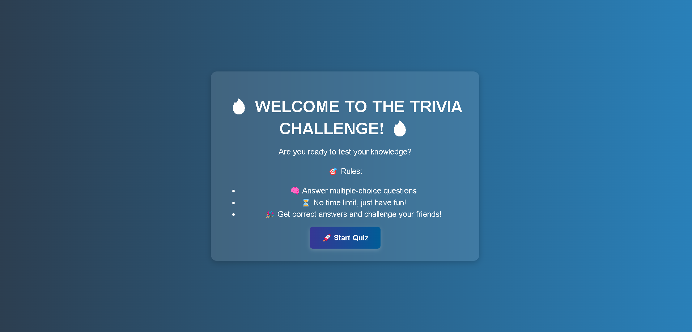

📌 Trivia Game - LLM-Based Quiz Generator

An AI-powered quiz generator that uses Ollama's open-source `Large Language Models` to create fun and challenging trivia questions.

🔧 Installation & Setup

1️⃣ Install Ollama & the AI Model

- The backend uses Ollama to run DeepSeek-R1 LLM locally.

1. Download & install Ollama

- 📥 Ollama Download
- Follow the instructions to install Ollama on your system.

2. Pull the required model

`ollama pull deepseek-r1:1.5b`

This downloads the DeepSeek-R1 1.5B model required for trivia generation.